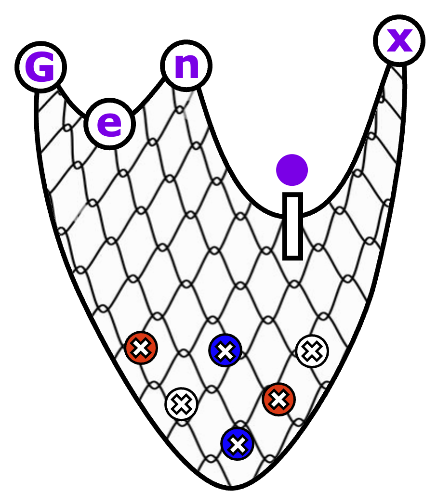

[](http://www.repostatus.org/#active)
[](https://www.tidyverse.org/lifecycle/#stable)

<p align="center" width="100%">
 
</p>

# Genix 

GENIX (Gene Expression Network Importance eXamination) is a novel glasso-based
network construction approach that elucidates the  identification of
perturbation-relevant gene signatures.


## Installation

**genix** can be installed directly from this github with:

```{r}
if (!require("devtools", quietly = TRUE))
  install.packages("devtools")

devtools::install_github("Sanofi-Public/PMCB-Genix", 
                         build_vignettes=FALSE)
```

If you wish to build a local version of the vignette use:

```{r}
if (!require("BiocManager", quietly = TRUE))
  install.packages("BiocManager")
BiocManager::install("BiocStyle")

devtools::install_github("Sanofi-Public/PMCB-Genix", 
                         build_vignettes=TRUE)
```


## Getting started

Once installed the best place to get started is the [vignette][vignette].


## Contact

For help and questions please contact the [sargent's maintenance team](mailto:nima.nouri@sanofi.com).


## Citing Genix

If you use Genix please cite our paper: Nouri N. et al. "Comparative Analysis of
Association Networks Using Single-Cell RNA Sequencing Data Reveals
Perturbation-Relevant Gene Signatures", JOURNAL, 2023, DOI.

```
  @Article{,
    author = {Nima Nouri et al.},
    title = {Comparative Analysis of Association Networks Using Single-Cell RNA 
    Sequencing Data Reveals Perturbation-Relevant Gene Signatures},
    journal = {Journal},
    year = {2023},
    url = {URL},
    doi = {DOI},
  }
```

[vignette]: https://github.com/Sanofi-Public/PMCB-Genix/blob/master/vignettes/Genix-Vignette.Rmd
[bioc]: https://bioconductor.org/packages/devel/bioc/html/genix.html
