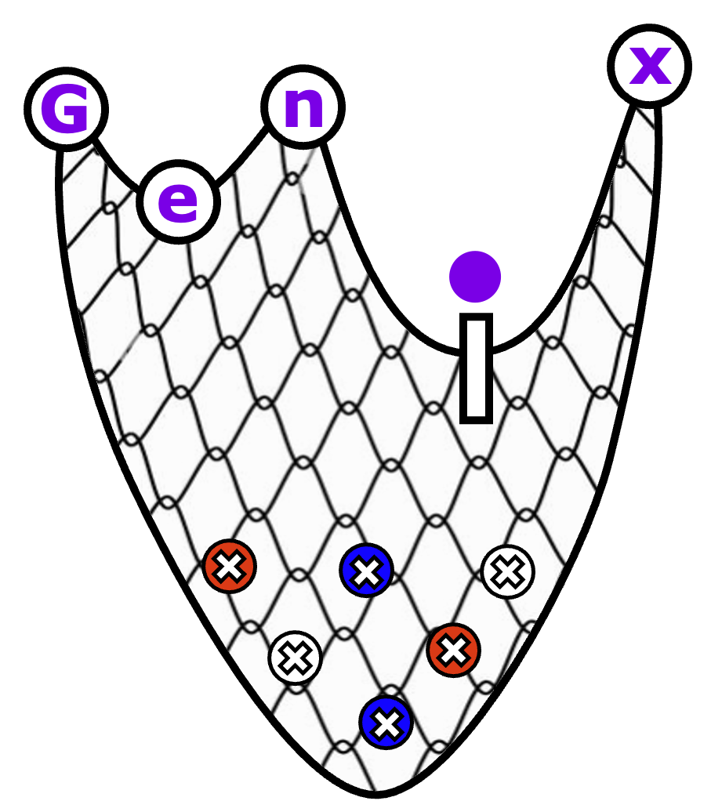

```{r knitr-options, echo = FALSE, message = FALSE, warning = FALSE}
knitr::opts_chunk$set(collapse=TRUE)
library(BiocStyle)
```

{width=55% height=55%}

Thank you for your interest in Genix! We present `genix` (Gene Expression Network
Importance eXamination), a novel platform for constructing gene association
networks based on glasso algorithm, equipped with an innovative network-based 
comparative model to uncover condition-relevant genes. In its entirety, `genix`
serves as an autonomous ecosystem for network construction. It takes a scRNA-seq
count matrix as input to generate undirected dependency graphs, alongside a
compilation of essential genes and gene modules. This vignette gives an 
overview and introduction to Genix’s functionality.

# Installation

Genix can be installed from GitHub:

```{r install-genix, eval = FALSE}
if (!require("devtools", quietly = TRUE))
  install.packages("devtools")

devtools::install_github("Sanofi-Public/PMCB-Genix", 
                         build_vignettes=FALSE)
```

If you wish to build a local version of the vignette use:

```{r vignette-genix, eval = FALSE}
if (!require("BiocManager", quietly = TRUE))
  install.packages("BiocManager")
BiocManager::install("BiocStyle")

devtools::install_github("Sanofi-Public/PMCB-Genix", 
                         build_vignettes=TRUE)
```

# Setup

To run the examples in this tutorial, you will need to install the `ggplot2` 
and `dplyr` packages. Once all installed, they can be loaded with the
following commands:

```{r require libraries, eval=TRUE, warning=FALSE, message=FALSE}
# Load required packages
library(ggplot2)
library(dplyr)
library(genix)
```

A small example database, `genixDemoData`, is included in the `genix` package. This
database contains the gene expression matrix of 200 cells (`gex`) formatted with 
genes as rows and cells as columns. Additionally, this database includes associated 
`metadata`. We can extract the relevant information for this demo using the
following commands:

```{r load-data, eval=TRUE, warning=FALSE, message=FALSE}
# load the demo data
data("genixDemoData")

# Access gene expression
gex <- genixDemoData$gex
print(dim(gex))
print(gex[1:10,1:10])

# Access meta data
metadata <- genixDemoData$metadata
print(dim(metadata))
print(head(metadata))
```

There are multiple columns in `metadata`, including typical `Seurat` metadata
columns such as `orig.ident`, `nCount_RNA`, and `nFeature_RNA`. Additionally, it
includes a `group` column that identifies the group to which each cell belongs:

```{r abbriv-table, eval=TRUE, warning=FALSE, message=FALSE}
print(table(metadata$group))
```

# Usecase

`genix` performs in three sequential steps:

**Constructing**: genix utilizes a glasso-based network construction approach to 
capture the expression dependencies across genes in single-cell data. By leveraging 
this probabilistic graphical model, `genix` effectively differentiates between direct 
and indirect connections while simultaneously avoiding the oversight of novel interactions. 
The glasso employs a tuning parameter (known as rho) to directly modulate the
sparsity level of the inferred network. Higher values of this parameter enhance
sparsity, whereas lower values diminish it. For this demo we use 1. 
Settinmg argument `scale.gex` to `true` the count expression matrix is
normalized to the mean library size, where each cell is scaled to sum up to the 
mean total counts. `qc.gex` helps with cells and genes pruning. Finally, by
providing the `group` information to the field argument, the constructNets
function will create a gene association network for each group:

```{r constructNets, eval=TRUE, warning=FALSE, message=FALSE}
rslts <- constructNets(gex=gex, 
                       glasso.rho=1.0, 
                       metadata=metadata, 
                       field="group",
                       scale.gex=TRUE, qc.gex=c(0.01,0.5), maxit=1e3)
print(length(rslts))
```

**Compiling**: `compileNets` function processes the input graphs in several steps. 
First, it filters out genes with connectivity lower than `degree.th`. 
The filtered graphs then undergo hub gene identification. A gene is considered a 
hub gene if it exhibits an outlier level of connectivity and is connected to more 
than `hubs.th` (fraction) of the genes in the graph. An outlier is defined as a 
gene with a degree exceeding at least 1.5 interquartile ranges above the 75th percentile 
of all degrees. Finally, the adjacency matrix calculated from the graph is retrieved 
to identify modules using the `cutreeDynamicTree` function.

```{r compileNets.1, eval=TRUE, warning=FALSE, message=FALSE}
cmpl_rslts <- compileNets(grph=rslts, degree.th=3, hubs.th=0.01, 
                          minModuleSize=7)

# get hub gene names and their degree of connectivity
print(head(cmpl_rslts$grp1@hubs))

# get length of identified modules
sapply(cmpl_rslts$grp1@modules, length)
```

To visualize the distribution of degrees in the compliled graph, pass on of the 
`cmpl_rslts` objects to `plotNetDegree` function. In this plot, the x-axis
represents the degree of each gene (the number of connections), and the y-axis
shows the number of genes with a specific degree:

```{r compileNets.2, eval=TRUE, warning=FALSE, message=FALSE}
plotNetDegree(cmpl_rslts$grp1)
```

**Comparing**: The last step involves comparing the topology of the constructed 
networks and examining the topological variations of genes. This systematic approach 
enables us to distinguish between topologically specific genes, whose overall 
interaction strength is highly condition-specific, and topologically invariant 
genes, whose connectivity pattern is not predominantly influenced by the perturbation.

```{r compareNets.1, eval=TRUE, warning=FALSE, message=FALSE}
cmpr_rslts <- compareNets(grph_1=cmpl_rslts$grp1, 
                          grph_2=cmpl_rslts$grp2, 
                          n.perm=25)
```

The function first calculates the similarity between `grph_1` and `grph_2` using the
Jaccard index, considering both shared genes and edges. Next, to stablish that the
observed differences in network structures are not mere artifacts of random
noise, but rather indicative of significant variations a permutation test is
developed. First, the two graphs are combined (union) into a pull. Next,
`grph_1` and `grph_2` are reconstructed by randomly sampling from
the pull, while preserving the original edge counts and connections, with
no-replacement. A distribution of jaccard similarities is generated
(`n.perm` time). This distribution is utilized to calculate a two-sided
t-test p-value, reflecting the proportion of permuted statistics that
differ from the observed jaccard index between `grph_1` and `grph_2`.

```{r compareNets.2, eval=TRUE, warning=FALSE, message=FALSE}
# print jaccard index similarity
print(round(cmpr_rslts@ji, 4))

# plot permutatiion test results
plotPermutes(cmpr_rslts)
```

The histogram above illustrates the distribution of Jaccard index similarities
(x-axis) obtained from the permutation test, comparing the pairs of graphs
that are sampled (n=25) from a union of observed graphs, `grph_1` and `grph_2`.
The y-axis indicates the density of occurrences for each similarity. The
vertical red dashed line denotes the observed similarity value. The displayed
p-value at the top is calculated using a two-sided t-test and serves to
demarcate statistically significant (p < 0.05) differences in network
structures.

Finally, to calculate the topological variations of genes, we devised a 
two-dimensional topological measure, which involves comparing the structure of 
`grph_1` and `grph_2` inferred graphs. First `compareNets` function performs an 
iterative gene removal process in both graphs. With each gene removal, the 
similarity index between graphs is recalculated. The gene removal impact (GRI)
for each gene is then calculated as the relative difference in post-removal
graph similarity compared to the pre-removal. To complement the GRI metric, we also 
incorporated the change in gene centrality to enhance our analysis. By comparing 
the normalized degree of connectivity for each gene within the `grph_1` and `grph_2`, 
we derived the gene centrality change (GCC) metric. 

`compareNets` further calculates the normalized values of degree,
closeness, and betweenness for each gene in two graphs, `grph_1` and `grph_2`. 
It then substrates the calculated topological characteristics to report deltas.
Positive values indicate that the feature is larger in the `grph_2`. All this 
information can be retrived by: 

```{r compareNets.3, eval=TRUE, warning=FALSE, message=FALSE}
# get topological feastures
print(head(cmpr_rslts@deltas))

# fetch top delta_degree's with above 1-sigma variation
tvgs <- fetchTVGs(cmpr_rslts, feature="delta_degree", sigma=1)
print(head(tvgs))
```

The hubness stsus of a given gene is mentioned in the column `type`

```{r compareNets.4, eval=TRUE, warning=FALSE, message=FALSE}
# get topological feastures
print(table(cmpr_rslts@deltas$type))

```

# Citing Genix

If you use `genix` in your work please cite our paper:

```{r citation}
citation("genix")
```

# Session information {.unnumbered}

This is the output of `sessionInfo()` on the system on which this document was compiled:
```{r}
sessionInfo()
```
